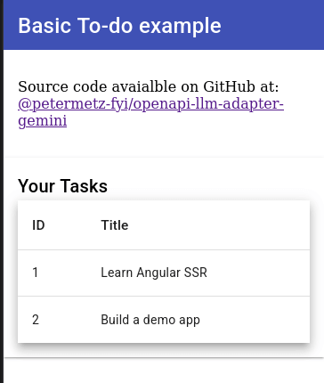

# @petermetz-fyi/openapi-llm-adapter-gemini

Visit the author's blog here: https://www.petermetz.fyi

## Usage

For a complete, working example, take a look at `./examples/basic-todo-mvc/agent.ts`

For the high level gist, here's how to perform the mapping for prompt enrichment and the task execution based on the LLM response:

```typescript

import { Configuration, Todo, TodoApi } from "./insert-your-generated-openapi-client-here/index";

import { newRunner } from "@petermetz-fyi/openapi-llm-adapter-gemini";
import { mapSpecsToTools } from "@petermetz-fyi/openapi-llm-adapter-gemini";
import { bundle, BundleResult } from "@redocly/openapi-core/lib/bundle";
import { loadConfig, makeDocumentFromString } from "@redocly/openapi-core";

//
// 1. PRE-PROCESSING
// - Read in the OpenAPI specifications' contents from the file-system or from wherever you get yours.
// - Any number of specifications are supported for mapping, not just a single one.
// - bundle and dereference the specifications with redocly - necessary precondition for the mapper to work
//

const openApiSpecsPaths = ["./src/openapi.json"];
const specsContents: Array<string> = [];
for (const specPath of openApiSpecsPaths) {
  const exists = await fs.existsSync(specPath);
  if (!exists) {
    console.warn("Skipping %s because it does not exist.", specPath);
    continue;
  }
  const specStr = await fs.readFileSync(specPath, "utf8");
  specsContents.push(specStr);
}

const bundleResultsPromises = specsContents.map(async (specStr) => {
  const config = await loadConfig({});
  const doc = makeDocumentFromString(specStr, "/");

  return bundle({
    doc,
    config,
    dereference: true,
  });
});
const bundleResults = await Promise.all(bundleResultsPromises);

// 
// 2. Perform the mapping from OpenAPI spec to Gemini Function Calls (tools)
//
const { tools } = await mapSpecsToTools({ bundleResults });

//
// 3. Call the LLM with the enriched prompt containing the OpenAPI operations
//
const result = await model.generateContent({
  contents: [{ role: "user", parts: [{ text: prompt }] }],
  tools,
});

//
// 4. Use the Runner component to execute the OpenAPI operations
//
const client = new TodoApi(
  new Configuration({ basePath: "http://localhost:3000" })
);
const runner = await newRunner<AxiosResponse<Todo>>({
  // verifying the response's validity is omitted for brevity
  call: result.response.candidates[0].content.parts[0].functionCall,
  client,
});

// This is where the actual execution happens
await runner.run();
```

## Running the Examples - Basic Todo App

1. Start by installing dependencies and building the code by running: `pnpm i`
2. Afterwards, you'll need a couple of separate terminals, one of the agent and another for the application itself.
3. Terminal 1 - Run the todo application and then open http://localhost:3000
   `pnpm tsx ./examples/basic-todo-mvc/main.ts `

   You should see something like this on the terminal:

   ```sh
   $ pnpm tsx ./examples/basic-todo-mvc/main.ts
   {"level":30,"time":1742423047004,"pid":107679,"hostname":"redacted","msg":"Server listening at http://[::1]:3000"}
   {"level":30,"time":1742423047005,"pid":107679,"hostname":"redacted","msg":"Server listening at http://127.0.0.1:3000"}
   Server listening on port 3000
   ```

   In the browser it should look like this:

   

4. Terminal 2 - Run the agent (equipped with the LLM adapter)
   `export GEMINI_API_KEY=<YOUR_GEMINI_API_KEY>`

   **This is where the magic happens**: by providing the path to your OpenAPI specification, the agent will automatically enrich your Gemini prompts with the potential list of operations that can be taken through the Todo REST API described by your spec.
   `pnpm tsx ./examples/basic-todo-mvc/agent.ts --open-api-specs ./examples/basic-todo-mvc/openapi.json`

   Expected standard output is that the agent is awaiting your instructions:

   ```sh
   $ pnpm tsx ./examples/basic-todo-mvc/agent.ts
   You:
   ```

5. Now instruct the agent to create a todo item:

   ```sh
   You: create a todo item for me to water the plants

   Bot: Certainly. Issuing the API call:
   {"name":"createTodoV1","args":{"title":"water the plants"}}
   ```

6. Now refresh the browser tab where you've opened up http://localhost:3000 and observe that the todo item was indeed created for you without the agent having any advance/hardcoded knowledge of your todo APIs capabilities. **It all happened dynamically at runtime.**

## Design Principles

- **Zero Runtime Dependencies**:

  - eliminates 99% of the daily CVE grind
  - Adding npm dependencies is a pandora’s box nowadays.
    - Libraries that are supposed to be tiny and self-contained ship with dozens or even hundreds of transitive dependencies.
    - Said transitive dependencies will have their own CVEs
    - Supply chain attacks are more and more common
    - Typosquatting is all the rage on both GitHub and npm.

- **Deterministic & Well Documented Fallbacks**
  - It (hopefully) keeps the package lean and platform independent (Browser, NodeJS, Bun, Deno, etc.).
- **Best Effort Mapping**:
  - Do not dwell too much on the input containing invalid specifications:
  - Lot of tooling out there that works fine with an otherwise technically invalid specification file
    that doesn't pass the official validator. What this means in practice is that we prefer to log a
    warning instead of throwing an exception if something goes wrong. This is the wrong thing to do in most
    application development scenarios, but in the context of a library that is meant to be working with a range of OpenAPI
    specifications as wide as possible it is a considered an acceptable trade-off for user experience.

## Useful Links

- https://aistudio.google.com/apikey
- https://github.com/google-gemini/generative-ai-js/blob/main/samples/function_calling.js
- https://github.com/google-gemini/cookbook/tree/main
- https://www.npmjs.com/package/@google/generative-ai
- https://redocly.com/docs/cli/commands/bundle
- https://swagger.io/specification/

## Contributing

1. Please do not add any runtime dependencies to the library. Trying to keep it lean and the daily CVE grind is not fun.
2. Make sure you ran the tests and they are passing: `pnpm i && pnpm test`
3. Ensure that the code you've changed or added has sufficient coverage by the tests.
4. Write legible commit messages adhering to the conventional commit standards.
5. Avoid breaking changes. If you believe you need to make one, open an issue first to validate your proposal.
6. In general it is a good idea to open an issue describing the change you are planning on making. That way if it is not wanted by the maintainer(s), you avoid wasting your time.

## Roadmap

1. Improve code quality of the mapper (less duplication)
2. Additional test cases for various OpenAPI specifications
3. Continuous Integration & Deployment
4. Eliminate all unchecked casts from the codebase outside of the tests
5. Fix all compiler warnings
6. Make the logger configurable instead of using the Console API for warnings.
7. Make it more convenient to perform the mapping with a single line of code through a utility function
